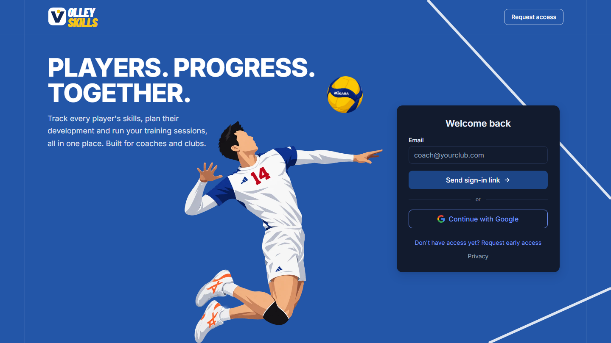
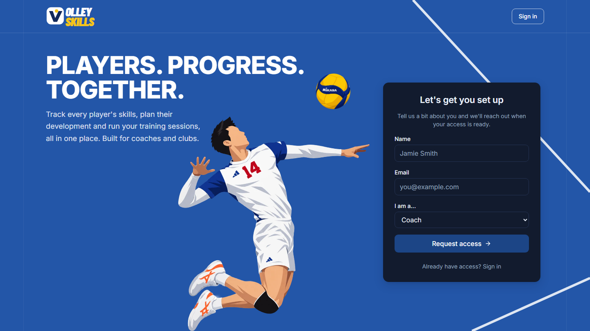
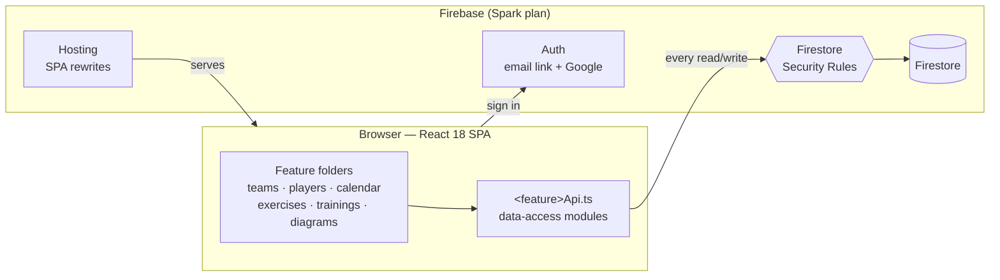
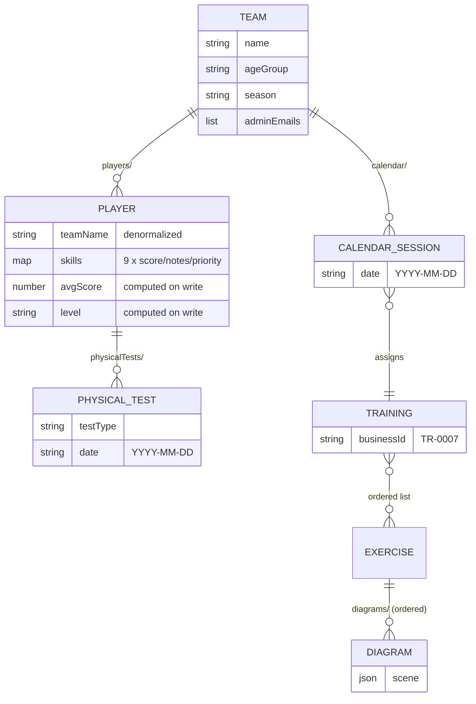

<p align="center">
  
</p>

<p align="center">
  <a href="https://github.com/Ledsav/volley-skills/actions/workflows/ci.yml"></a>
  
  
  
  
  
</p>

<p align="center">
  <b>A web app for volleyball clubs to track player skills, plan development,<br/>
  run physical testing sessions and build training programs, all in one place.</b>
</p>

---

**Volley Skills** replaces a per-player spreadsheet with a real tool for coaches. Each team has a
roster, and each player has a skills card, a development plan and a physical-testing history. The
club shares an exercise and training library, and every exercise can have its own court diagrams.

It is a **single-club** app built entirely on Firebase's free tier: no servers and no Cloud
Functions. Every access rule is enforced in Firestore Security Rules, and those rules have their
own test suite. Players are minors, so privacy is a first-class requirement, not an afterthought.

<p align="center">
  
  
</p>

## Features

<table>
  <tr>
    <td width="50%" valign="top">
      <h3>Teams &amp; rosters</h3>
      Teams with a lineup-ordered roster (setter, outside, opposite, middle, libero). Each row shows
      a player's skill scores, their average and a colour-coded level.
    </td>
    <td width="50%" valign="top">
      <h3>Player cards</h3>
      Contact and guardian details, 9 skills scored 1–10 with coach notes and priority flags, and a
      development plan with short-term and season-long objectives.
    </td>
  </tr>
  <tr>
    <td valign="top">
      <h3>Physical testing</h3>
      Growth, countermovement jump, approach jump, broad jump, 10 m sprint, 5-10-5 shuttle, reaction
      time and strength. <b>Live testing sessions</b> let a coach record several players at once
      from a phone in the gym, with built-in stopwatches.
    </td>
    <td valign="top">
      <h3>Exercise &amp; training library</h3>
      A shared, paginated exercise library and trainings built from ordered exercises, each with a
      sequential ID like <code>TR-0007</code>. Supports <b>bulk JSON import</b>, e.g. to paste in
      AI-generated drills.
    </td>
  </tr>
  <tr>
    <td valign="top">
      <h3>Court diagram builder</h3>
      A full-screen canvas editor for drawing drills: court, net, players, balls, cones, ladders,
      lines, arrows and text. Diagrams are saved as small JSON scenes and drawn as SVG wherever they
      appear.
    </td>
    <td valign="top">
      <h3>Team calendar</h3>
      A month view per team where coaches assign trainings from the shared library to dates.
    </td>
  </tr>
  <tr>
    <td valign="top">
      <h3>Scoped access</h3>
      Superadmins manage everything; members get access per team and per section (exercises,
      trainings, guides). Access is granted by email, so there's no user-ID lookup.
    </td>
    <td valign="top">
      <h3>Privacy by design</h3>
      Passwordless sign-in, no analytics or tracking scripts, a public privacy page, and per-player
      data export and deletion (GDPR access rights).
    </td>
  </tr>
</table>

### Skill levels

A player's average across the 9 skills maps to one of four levels. The same four colours are used
everywhere a level appears.

| Level                                                                    | Average score |
| ------------------------------------------------------------------------ | ------------- |
|      | below 4       |
|  | 4 to below 6  |
|      | 6 to below 8  |
|            | 8 and above   |

## Architecture



- **All authorization lives in [`firestore.rules`](firestore.rules).** Components never call
  Firestore directly; they go through the `<feature>Api.ts` modules, which return plain typed
  objects.
- **No unbounded reads.** Libraries and history timelines use `orderBy().limit()` with cursor
  pagination, and the calendar only loads the visible month. Every query has a matching index in
  [`firestore.indexes.json`](firestore.indexes.json).
- **Computed fields are saved on write, not calculated in the UI** (a player's average and level,
  a training's ID).

### Data model



The club also has app-wide config docs: `skillGuide/config`, `physicalTestGuide/config`,
`sectionAccess/*` and `counters/trainings`. Dates are ISO `YYYY-MM-DD` strings so date ranges can
be queried directly. The full contract is in the
[app design spec](docs/superpowers/specs/2026-09-04-volley-skills-app-design.md).

## Getting started

**Prerequisites:** Node 20+. The Firestore emulator and the security-rules tests also need JDK 21+.

```bash
npm install
npm run dev:emulator   # boots Auth + Firestore emulators, seeds data, starts Vite
```

That one command is the easiest way to work locally, and nothing touches production. Stop
everything with <kbd>Ctrl</kbd>+<kbd>C</kbd>. The Auth emulator prints the email sign-in link to
its console, since no real email is sent. The emulator keeps data in memory, so re-seed after
every restart. See [`scripts/seed/README.md`](scripts/seed/README.md) for the full guide.

### Scripts

| Command                 | What it does                                                       |
| ----------------------- | ------------------------------------------------------------------ |
| `npm run dev`           | Vite dev server against real Firebase                              |
| `npm run dev:emulator`  | Emulators + seed + Vite in one go                                  |
| `npm run emulator`      | Start the Auth (:9099), Firestore (:8080) and UI (:4000) emulators |
| `npm run seed:emulator` | Reset and seed the running emulator                                |
| `npm test`              | Unit + component tests (Vitest, React Testing Library)             |
| `npm run test:rules`    | Firestore Security Rules tests against the emulator                |
| `npm run lint`          | ESLint                                                             |
| `npm run build`         | Type check + production build                                      |

## Project structure

```text
src/
├── auth/            sign-in, guards (RequireAuth / RequireSection / RequireSuperAdmin)
├── teams/           teams list, team page, roster
├── players/         player card, skills, development plan
├── physicalSessions/ live multi-player testing sessions
├── calendar/        team month view
├── exercises/       exercise library
├── diagrams/        court diagram editor + SVG renderer
├── trainings/       training builder + library
├── bulkImport/      JSON bulk import
├── access/          access manager (superadmin)
├── components/      shared UI: Button, Input, SkillMeter, Logo, …
├── layout/          app shell, sidebar
├── types/           all Firestore document types
└── firebase/        SDK init + emulator wiring (the only place)
tests/rules/         security-rules test suite
docs/superpowers/    design specs + implementation plans
```

## Testing

The priority order is **rules tests first**, then pure-logic unit tests (skill maths, training ID
sequencing, physical-test calculations), then component tests for the most important forms.

- **Security rules** (`tests/rules/`) are the real check on the security boundary. Every rules
  change comes with a test.
- Tests sit next to the code they cover: `skillMath.ts` → `skillMath.test.ts`.
- CI ([`ci.yml`](.github/workflows/ci.yml)) runs lint, build, unit tests and rules tests on every
  pull request and every push to `main`.

## Design system


The visual language is documented in the
[design system spec](docs/superpowers/specs/2026-09-04-volley-skills-design-system.md).

- **Colour:** navy `#2356A8` for structure and primary actions, blue `#2865F6` for interactive
  elements, and orange / green / red for status and levels.
- **Type:** Inter (self-hosted) everywhere, plus Barlow Condensed Black Italic for the logo only.
- **Icons:** [Lucide](https://lucide.dev).
- Light-first, with a dark theme.

## Privacy

This app stores data about minors and their guardians. Keep it that way:

- **No** third-party analytics or tracking scripts.
- **Never** commit `serviceAccountKey.json`, `.env.local` or `reference/`; all three are gitignored.
- Production readiness items are tracked in [`docs/PRODUCTION-READINESS.md`](docs/PRODUCTION-READINESS.md).
